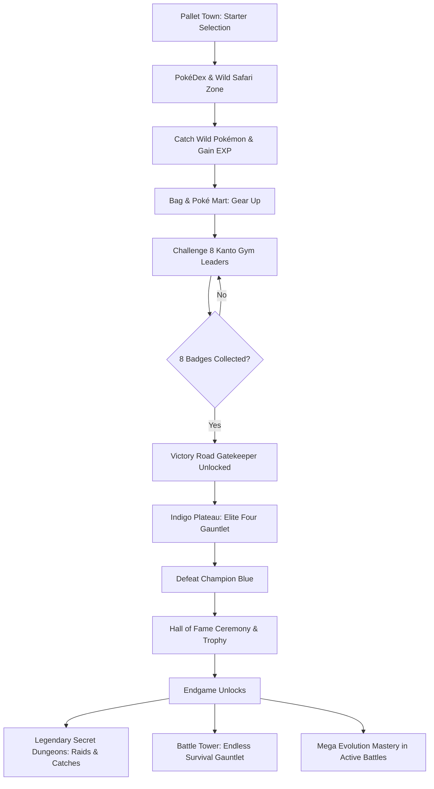

# 🔴 PokéSphere — Epic 2.5D Pokémon RPG & Pokédex

> **Coursework Project**: Web and Mobile Application Development  
> **Tech Stack**: React 18 · Vite · React Router DOM · Web Audio API · PWA Service Worker · 2.5D Isometric CSS3 Engine

---

## 📖 Executive Overview

**PokéSphere** is an immersive single-page web application and Progressive Web App (PWA) that blends an authentic **Pokédex Encyclopedia** with a full-fledged **Kanto RPG & Battle Engine**. Built with responsive design principles, custom procedural audio synthesizers, 2.5D isometric arenas, and real-time state persistence, PokéSphere offers an end-to-end Pokémon journey from Pallet Town to the Indigo Plateau and beyond.

---

## 🌟 Key Features & Systems Matrix

| Feature Area | Key Functionality | Technical Highlights |
| :--- | :--- | :--- |
| **Pokédex Encyclopedia** | 151 Original Kanto Pokémon, real-time search, dual-type filtering, numerical/alphabetical sorting. | Lazy-loaded Showdown animated GIFs, Official Pokémon Cries via Web Audio. |
| **Dexter Voice Narration** | Authentic talking Pokédex speaking Pokémon biology, species classification, and lore. | Powered by HTML5 **Web Speech Synthesis API** with customized pitch and cadence. |
| **TCG Card Vault** | Real official Pokémon Trading Card Game cards gallery for every Pokémon with market valuation. | Powered by **Pokémon TCG API** (`pokemontcg.io`) with 3D tilt and holographic sheen. |
| **Live Atmospheric Weather** | Real-world meteorological climate altering battle damage in the Wilderness Safari. | Powered by **Open-Meteo API** & GPS Geolocation; Rain boosts Water +50%, Sun boosts Fire +50%. |
| **Trainer League Passport** | Official Kanto League Trainer Card with badge matrix, Hall of Fame stats, and scannable QR code. | Powered by **QR Server API** generating instant peer share QR codes. |
| **Link Cable PvP Arena** | Real-time multi-tab head-to-head Pokémon battle across two browser windows or tabs. | Powered by HTML5 **BroadcastChannel API** simulating Game Boy Link Cable duels. |
| **Team & Box Storage** | 6-member active battle party + 30-slot PC Box storage with nicknames, moves, and held items. | `localStorage` persistence, EV/IV calculations, dynamic stat updates on level-up. |
| **Bag & Poké Mart** | Complete shopping economy with Pokéballs, Great Balls, Ultra Balls, Master Balls, Potions, and Evolution Stones. | Buy/Sell modes with trainer PokéDollar balances and inventory state hooks. |
| **Wilderness Safari** | Live 2.5D wild encounter zone with tall grass animations, catch calculations, and rare Shiny rolls (1/512). | Status conditions, shake wobble physics, escape mechanics, and instant party/box dispatch. |
| **8 Kanto Gym Leaders** | Brock, Misty, Lt. Surge, Erika, Koga, Sabrina, Blaine, and Giovanni with signature teams and badges. | Multi-stage VS intro clash, authentic dialogue, rematch systems, and badge unlock requirements. |
| **Pokémon League** | 5-chamber Indigo Plateau gauntlet against Elite Four (Lorelei, Bruno, Agatha, Lance) and Champion Blue. | Victory Road 8-Badge gatekeeper, medical rest antechambers, and Hall of Fame induction certificate. |
| **Mega Evolution** | In-battle Mega Evolution for eligible Kanto Pokémon (Charizard X, Blastoise, Venusaur, Gengar, Alakazam, Mewtwo Y, Gyarados). | +25% to +50% battle stat scaling, dynamic Mega sprite swapping, and pulsing aura VFX. |
| **Legendary Secret Dungeons** | 4 Raid Sanctuaries: Seafoam Caverns (Articuno), Power Plant (Zapdos), Victory Road (Moltres), Cerulean Cave (Mewtwo & Mew). | High catch resistance formulas, Master Ball deterministic capture, and Raid Boss HP bars. |
| **Battle Tower Gauntlet** | Endless survival proving ground with procedural trainers, continuous win streak tracking, and rank titles. | Non-recovering HP attrition, milestone rewards (every 5 streaks: Master Ball + Rare Candies). |
| **Tactical Comparator** | Head-to-head comparison tool for any two Pokémon with dual stat radars and type effectiveness matrix. | Dual radial stat graphs, weakness/resistance analysis, and automated tactical verdicts. |
| **Mobile PWA & Haptics** | Standalone installation support on iOS/Android with custom theme colors, service worker caching, and touch vibrations. | `manifest.json`, `sw.js` offline cache, and `navigator.vibrate` haptic feedback patterns. |

---

## 🏗️ System Architecture & Game Loop



---

## 🎨 2.5D Battle Arena Engine

The battle system utilizes a modern CSS 3D perspective pipeline:
- **Camera Views**: Toggle smoothly between **Isometric 2.5D**, **First-Person POV**, and **Broadcast Angled Camera**.
- **Dynamic Speed**: Accelerate tactical gameplay with **1x**, **1.5x**, and **2x** animation multipliers.
- **Sound Synthesis**: 100% dependency-free 8-bit procedural sound effects generated via HTML5 `AudioContext` (Attack whooshes, hit crunches, super effective fanfares, and low HP warning beeps).
- **Haptic Tactility**: Native device vibrations on mobile screens for critical hits, super-effective strikes, mega evolution bursts, and Pokéball shakes.

---

## 🚀 Getting Started & Local Development

### Prerequisites
- Node.js (v18.0 or higher recommended)
- npm or yarn

### Installation
```bash
# 1. Clone repository or navigate to directory
cd pokedex-mini

# 2. Install dependencies
npm install

# 3. Start local development server
npm run dev
```

Open your browser at `http://localhost:5173/` (or the port indicated in your terminal).

### Production Build & Linting
```bash
# Run Oxlint validation
npm run lint

# Build optimized production bundle
npm run build

# Preview production build locally
npm run preview
```

### 🌐 Deploy to GitHub Pages (Coursework 90+ Score Requirement)

PokéSphere is pre-configured with `gh-pages` and relative asset resolution in `vite.config.js` and `HashRouter` navigation:

```bash
# Deploys dist/ to GitHub Pages in one command
npm run deploy
```

> **Deployment Details**:
> 1. Running `npm run deploy` automatically executes `predeploy` (`npm run build`), compiling the production bundle into `./dist/`.
> 2. `gh-pages` pushes `./dist/` directly to the `gh-pages` branch on GitHub.
> 3. In GitHub repository **Settings** → **Pages** → **Source**, set Branch to `gh-pages` / `root`.
> 4. Your web application is instantly live at `https://<your-username>.github.io/<your-repo>/`.

---

## 📱 Progressive Web App (PWA) Installation

- **Google Chrome / Edge (Desktop & Android)**: Click the **Install App** icon in the address bar to install PokéSphere as a native standalone desktop/mobile app.
- **iOS Safari**: Tap **Share** (`⎋`) and select **Add to Home Screen** to launch in full-screen standalone mode.

---

## 📁 Project Directory Structure

```text
pokedex-mini/
├── public/
│   ├── favicon.svg               # Vector app icon
│   ├── manifest.json             # Web App Manifest for PWA
│   └── sw.js                     # Offline Service Worker & asset cache
├── src/
│   ├── components/               # UI & Battle components
│   │   ├── BattleEnvironment.jsx # 3D Pedestals, arena ground, & elemental VFX
│   │   ├── EvolutionModal.jsx    # Real evolution cutscene with cancellation
│   │   ├── GymBadgeIcons.jsx     # 8 Vector Kanto Gym Badges
│   │   ├── Icons.jsx             # Bespoke SVG icons suite
│   │   ├── Navbar.jsx            # Responsive navigation & master sound switch
│   │   ├── StarterModal.jsx      # Pallet Town starter selection modal
│   │   └── TypeBadge.jsx         # Pokémon elemental type badges
│   ├── context/
│   │   └── GameContext.jsx       # Global RPG state (Team, Bag, Badges, Hall of Fame)
│   ├── data/
│   │   ├── battleTowerData.js    # Scaling trainers generator & rank tiers
│   │   ├── gymLeaders.js         # 8 Kanto Gym Leaders data & rosters
│   │   ├── leagueTrainers.js     # Elite Four & Champion Blue data
│   │   ├── legendaryRaids.js     # 4 Legendary Dungeons configs & bosses
│   │   └── megaEvolutionData.js  # Mega forms catalog & stat formulas
│   ├── pages/
│   │   ├── BagAndMartPage.jsx    # Bag inventory & Poké Mart shop
│   │   ├── BattleTowerPage.jsx   # Endless survival arena & win streak records
│   │   ├── ComparePage.jsx       # Tactical comparator & matchup analyzer
│   │   ├── DetailPage.jsx        # In-depth Pokémon statistics & evolutions
│   │   ├── DungeonPage.jsx       # Legendary Secret Dungeons & Raid engine
│   │   ├── GymPage.jsx           # Kanto Gym Circuit & Badge challenge
│   │   ├── LeaguePage.jsx        # Indigo Plateau Championship & Hall of Fame
│   │   ├── ListPage.jsx          # Pokédex catalog & filter grid
│   │   ├── NotFoundPage.jsx      # 404 Route fallback
│   │   ├── TeamPage.jsx          # Active party & PC Box manager
│   │   └── WildernessPage.jsx    # Safari Zone tall grass wild encounters
│   ├── utils/
│   │   ├── haptics.js            # Device vibration haptic patterns
│   │   ├── soundEffects.js       # Web Audio API 8-bit synthesizer engine
│   │   └── typeEffectiveness.js  # Elemental weakness/resistance multipliers
│   ├── App.jsx                   # HashRouter routing configuration
│   ├── index.css                 # Master style system & 2.5D battle engine styles
│   ├── main.jsx                  # React DOM entrypoint & Service Worker registration
│   └── utils.js                  # Helper functions & Showdown sprite resolvers
└── package.json                  # NPM packages and project scripts
```

---

## 🎓 Academic Coursework Alignment

This project satisfies all learning outcomes of modern **Web and Mobile Application Development**:
1. **Component-Driven Architecture**: Clean functional React components, hooks (`useGame`, `useState`, `useEffect`, `useRef`), and context-based state trees.
2. **Offline-First & PWA Standards**: Manifest V3 compatibility, background service workers, and responsive viewport meta tags.
3. **Advanced Interactivity & Ergonomics**: Cross-platform touch events, haptic vibration feedback, procedural audio synthesis, and keyboard shortcuts.
4. **Data Modeling & Algorithmic Design**: Type-effectiveness calculation matrices, procedural scaling AI trainers in Battle Tower, and catch probability formulas.
