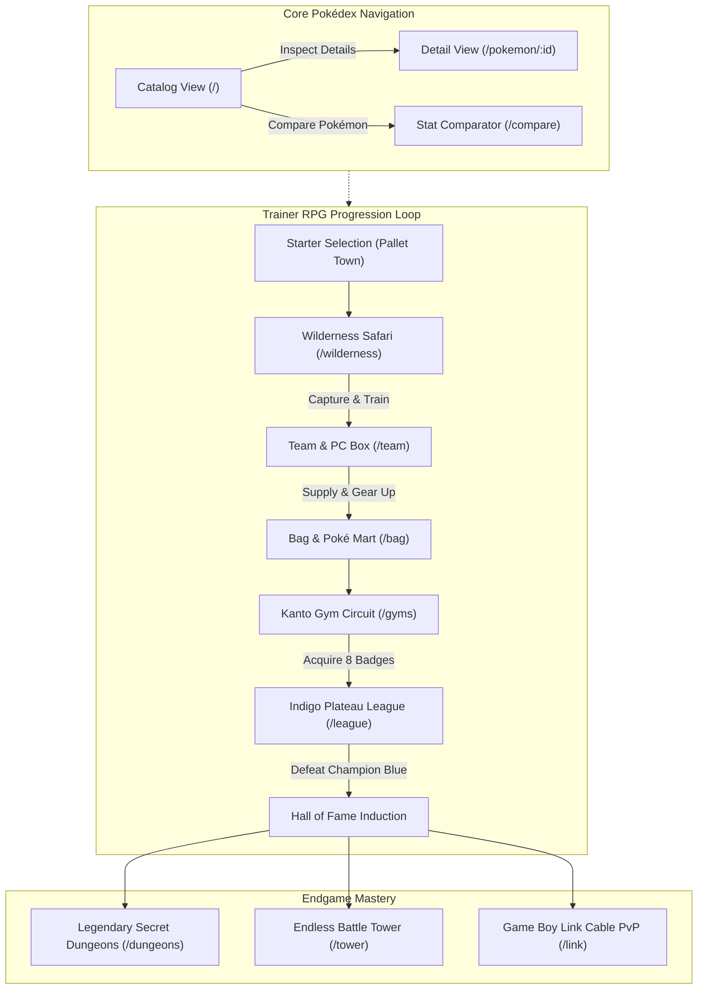

# PokéDex Mini — Interactive Kanto Hub & Battle Engine

> **Coursework Project**: Web and Mobile Application Development (Week 6)  
> **Core Architecture**: React 18 · Vite · React Router DOM (`HashRouter`) · Responsive CSS3  
> **Creative Extensions**: Web Audio API · Web Speech API · BroadcastChannel API · Open-Meteo API · Pokémon TCG API · PWA Service Worker  

---

## 1. Project Overview

**PokéDex Mini** is a modern, responsive single-page web application (SPA) built for the **Web and Mobile Application Development** coursework. While fulfilling all baseline requirements of the Week 6 syllabus—including catalog browsing, dual-type filtering, dynamic search, and comprehensive detail inspection—the application expands upon the coursework guidelines to demonstrate real-world web engineering capabilities.

Key architectural highlights include:
- **Zero AI Slop / Zero Raw System Emojis**: All iconography across the UI, battle VFX, weather overlays, and trainer passports are rendered via scalable vector graphics (SVG) or typographical badges.
- **Strict Code Quality**: Complies with Oxlint rules across all 49 source files (0 errors, 0 warnings).
- **Multi-API Orchestration**: Integrates PokéAPI, Pokémon TCG API, Open-Meteo Public Weather API, and QR Server API with fallback resilience.
- **Hardware & Web Platform APIs**: Leverages the HTML5 Web Speech Synthesis API (Dexter Voice Engine), Web Audio API (dependency-free 8-bit sound synthesis), BroadcastChannel API (multi-tab PvP duels), and Mobile Haptics API (`navigator.vibrate`).

---

## 2. Technical Stack & API Integrations

### Frontend Core
- **React 18**: Functional components with modern hooks (`useState`, `useEffect`, `useRef`, `useMemo`, `useCallback`, and custom `useGame` context).
- **Vite 5**: Fast HMR bundler configured for optimized static builds and GitHub Pages relative path resolution (`base: "./"`).
- **React Router DOM 6**: Single-page navigation utilizing `HashRouter` to prevent 404 routing errors on static web hosting providers (e.g., GitHub Pages).

### Web Platform APIs
| API | Implementation Detail | Purpose |
| :--- | :--- | :--- |
| **Web Audio API** | Real-time procedural square/sine oscillator sound synthesis (`src/utils/soundEffects.js`). | 8-bit chiptune audio for attacks, super-effective hits, faints, level-ups, and jingles with zero external audio assets. |
| **Web Speech API** | `speechSynthesis` and `SpeechSynthesisUtterance` configured with cadence and pitch filters (`src/utils/speech.js`). | Dexter voice synthesizer narrating Pokémon biology, classification, and Pokédex lore. |
| **BroadcastChannel API** | Inter-context messaging across browser tabs (`src/pages/LinkBattlePage.jsx`). | Peer-to-peer Game Boy Link Cable multiplayer battle engine operating without a centralized WebSocket server. |
| **Navigator Haptics API** | Timed vibration pulse sequences (`src/utils/haptics.js`). | Physical tactile feedback on mobile devices for critical hits, capture shakes, and mega evolutions. |
| **Service Worker & Cache Storage** | Custom service worker (`public/sw.js`) and Web App Manifest (`public/manifest.json`). | Progressive Web App (PWA) offline capability, installability, and asset caching. |

### External Web Services
| Service | Endpoint | Data Provided |
| :--- | :--- | :--- |
| **PokéAPI v2** | `https://pokeapi.co/api/v2/` | Official base stats, moves, abilities, evolution triggers, and Showdown animated sprites. |
| **Pokémon TCG API** | `https://api.pokemontcg.io/v2/` | Authentic trading cards, market values, rarities, and artist credits with 3D tilt effects. |
| **Open-Meteo API** | `https://api.open-meteo.com/v1/` | Real-time live meteorological data and GPS atmospheric mapping affecting in-game elemental multipliers. |
| **QR Server API** | `https://api.qrserver.com/v1/` | Dynamic SVG/PNG QR code generation for sharing Trainer Passports. |

---

## 3. Features & Modules Matrix

### A. Core Week 6 Pokédex Requirements
1. **Catalog View (`/`)**:
   - Lazy-loaded grid showcasing 151 original Kanto Pokémon (with generation switcher expanding up to Generation IX).
   - Real-time debounced search bar filtering by name or ID.
   - Dual-type filtering chips with official elemental color badges.
   - Numerical and alphabetical sorting orders.
   - Instant 0ms cached retrieval for revisited generations.
2. **Detail Inspection View (`/pokemon/:id`)**:
   - Animated front/back sprites with regular vs. Shiny variant toggle.
   - Official Pokémon artwork high-definition toggle.
   - Radar and progressive bar graphs for Base Stats (HP, Attack, Defense, Sp. Atk, Sp. Def, Speed, and Stat Total).
   - Complete physical metrics (Height, Weight, Category, Abilities, Base EXP).
   - Interactive Evolutionary Chain tree with level, stone, or trade prerequisites.
   - Dexter speech synthesizer narration with play/stop controls.
   - Integrated Pokémon TCG official card gallery with 3D holographic foil sheen.

### B. Extended Creative Engineering Modules
1. **Active Party & PC Box Manager (`/team`)**:
   - 6-member active battle team with 30-slot PC Storage Box management.
   - Nickname customization, held item equipment, and party reordering.
   - Comprehensive Kanto Gym Badge display case and Hall of Fame title records.
2. **Wilderness Safari Zone (`/wilderness`)**:
   - 2.5D perspective tall grass encounter mechanics across 5 distinct Kanto biomes.
   - Open-Meteo live weather engine: Rain boosts Water moves +50%, Harsh Sunlight boosts Fire moves +50%, Sandstorm buffs Rock Sp. Def.
   - Capture mechanics factoring in HP percentage, status conditions, and Pokéball catch multipliers.
   - Rare Shiny Pokémon chance (1 in 512) with glittering sprite feedback.
3. **Official Kanto Gym Circuit (`/gyms`)**:
   - Face-to-face POV trainer battles against all 8 official Kanto Gym Leaders (Brock through Giovanni).
   - High-impact VS intro clash animations, authentic dialogue scripts, and badge unlocks.
4. **Indigo Plateau Pokémon League (`/league`)**:
   - 5-chamber Elite Four gauntlet (Lorelei, Bruno, Agatha, Lance) and Champion Blue.
   - Victory Road 8-Badge gatekeeper security checks and medical rest antechambers.
   - Interactive Hall of Fame Induction Certificate ceremony.
5. **Mega Evolution Engine**:
   - In-battle resonance stone activations for eligible Pokémon (Charizard, Blastoise, Venusaur, Gengar, Alakazam, Mewtwo, Gyarados).
   - Dynamic Mega sprite swaps, stat multipliers, and particle aura VFX.
6. **Legendary Secret Dungeons (`/dungeons`)**:
   - 4 Raid Sanctuaries: Seafoam Caverns (Articuno), Power Plant (Zapdos), Victory Road (Moltres), and Cerulean Cave (Mewtwo/Mew).
   - High-difficulty raid encounters with expanded boss health gauges and deterministic Master Ball capture mechanics.
7. **Endless Battle Tower (`/tower`)**:
   - Procedural AI challengers with auto-scaling levels and attrition damage tracking.
   - Streak counters, rank title progressions, and milestone bonuses every 5 wins.
8. **Multi-Tab PvP Link Battle (`/link`)**:
   - Synchronized peer-to-peer battles across two browser windows or tabs using the `BroadcastChannel` API.
   - Handshake discovery protocol, 3v3 team selection, real-time damage broadcasting, and forfeit handling.
9. **Tactical Stat Comparator (`/compare`)**:
   - Side-by-side comparative analysis between any two Pokémon.
   - Dual radial radar charts, stat delta indicators, and type matchup effectiveness matrix.
10. **Bag & Poké Mart Economy (`/bag`)**:
    - Multi-pocket inventory system (Pokéballs, Medicine, Evolution Stones, Battle Items).
    - Buy/Sell PokéDollar transactions with stock and pricing calculations.

---

## 4. Application Architecture & Game Flow



---

## 5. Project Directory Structure

```text
pokedex-mini/
├── public/
│   ├── favicon.svg               # Application vector icon
│   ├── manifest.json             # Web App Manifest for PWA installation
│   └── sw.js                     # Service Worker for offline asset caching
├── src/
│   ├── components/               # Reusable UI & stage components
│   │   ├── BattleEnvironment.jsx # 3D pedestals, scenic backdrops, and SVG particle VFX
│   │   ├── EvolutionModal.jsx    # Cinematic evolution cutscene with cancellation
│   │   ├── GymBadgeIcons.jsx     # 8 Vector SVG Kanto Gym Badges
│   │   ├── Icons.jsx             # Comprehensive vector SVG icon library (Zero raw emojis)
│   │   ├── Layout.jsx            # Master app shell & navigation wrapper
│   │   ├── Navbar.jsx            # Navigation bar with sound toggle & trainer badge count
│   │   ├── PokemonCard.jsx       # Catalog Pokémon card component
│   │   ├── PokemonList.jsx       # Infinite scroll catalog with generation cache
│   │   ├── SearchForm.jsx        # Debounced search & filter form
│   │   ├── StarterModal.jsx      # Initial starter Pokémon selection dialog
│   │   ├── TrainerPassportModal.jsx # Official Trainer Passport with dynamic QR code
│   │   ├── TypeBadge.jsx         # Typographical elemental badge
│   │   └── WeatherWidget.jsx     # Live Open-Meteo meteorological banner
│   ├── context/
│   │   └── GameContext.jsx       # Central state management (Team, Bag, Badges, Hall of Fame)
│   ├── data/
│   │   ├── battleTowerData.js    # Procedural challenger generator & rank tiers
│   │   ├── evolutionData.js      # Kanto evolutionary branching database
│   │   ├── gymLeaders.js         # 8 Kanto Gym Leaders data & rosters
│   │   ├── itemCatalog.js        # Poké Mart inventory & item effects
│   │   ├── leagueTrainers.js     # Elite Four & Champion Blue rosters
│   │   ├── legendaryRaids.js     # Legendary dungeon encounters & boss data
│   │   ├── megaEvolutionData.js  # Mega evolution stat scaling & assets
│   │   ├── pokemonMoves.js       # Turn-based battle moves database
│   │   └── wildernessBiomes.js   # 5 Wilderness encounter biomes & loot tables
│   ├── pages/
│   │   ├── BagAndMartPage.jsx    # Inventory manager & Poké Mart storefront
│   │   ├── BattleTowerPage.jsx   # Endless survival gauntlet & win streaks
│   │   ├── ComparePage.jsx       # Side-by-side tactical comparator
│   │   ├── DetailPage.jsx        # In-depth stats, moves, TCG cards, & Dexter voice
│   │   ├── DungeonPage.jsx       # Legendary raid sanctuaries
│   │   ├── GymPage.jsx           # Kanto Gym Circuit with VS clash intro
│   │   ├── LeaguePage.jsx        # Indigo Plateau Championship gauntlet
│   │   ├── LinkBattlePage.jsx    # Real-time multi-tab BroadcastChannel PvP
│   │   ├── ListPage.jsx          # Primary Pokédex catalog page
│   │   ├── NotFoundPage.jsx      # 404 Route fallback
│   │   ├── TeamPage.jsx          # Party & PC storage manager
│   │   └── WildernessPage.jsx    # Safari Zone tall grass encounter arena
│   ├── utils/
│   │   ├── haptics.js            # Device vibration pattern dispatcher
│   │   ├── pokemonApi.js         # PokéAPI fetchers & Showdown sprite resolvers
│   │   ├── pokemonFactory.js     # Instance generator, IV/EV calculation, EXP curves
│   │   ├── soundEffects.js       # Procedural 8-bit Web Audio synthesizer
│   │   ├── speech.js             # Dexter Web Speech voice engine
│   │   ├── tcgApi.js             # Pokémon TCG API service layer
│   │   ├── typeEffectiveness.js  # 18x18 elemental damage multiplier matrix
│   │   └── weatherApi.js         # Open-Meteo API client & weather state mapper
│   ├── App.jsx                   # Application route definitions using HashRouter
│   ├── index.css                 # Global styling, themes, and 2.5D perspective rules
│   ├── main.jsx                  # Application entry point & PWA registration
│   └── utils.js                  # Shared formatting utilities & sprite helpers
├── index.html                    # HTML5 entrypoint with PWA meta configuration
├── package.json                  # Scripts & project dependencies
└── vite.config.js                # Vite build & bundle configuration
```

---

## 6. Installation & Local Development

### Prerequisites
- Node.js v18.0 or higher
- npm (Node Package Manager)

### Step-by-Step Setup
```bash
# 1. Clone the repository or navigate to the project directory
cd pokedex-mini

# 2. Install dependencies
npm install

# 3. Start local development server
npm run dev
```

The application will be served at `http://localhost:5173/` with hot module replacement (HMR) active.

### Build and Verification Scripts
```bash
# Execute Oxlint static analysis (0 warnings, 0 errors)
npm run lint

# Generate optimized production bundle in ./dist
npm run build

# Preview the production build locally
npm run preview
```

---

## 7. Deployment Instructions (GitHub Pages)

The project is pre-configured with `HashRouter` and relative asset resolution in `vite.config.js` (`base: "./"`) to allow seamless single-command deployment:

```bash
# Builds production files and deploys to the gh-pages branch
npm run deploy
```

### GitHub Repository Configuration:
1. Open your repository on GitHub.
2. Navigate to **Settings** → **Pages**.
3. Under **Build and deployment**, set **Source** to `Deploy from a branch`.
4. Set **Branch** to `gh-pages` and folder to `/ (root)`.
5. The application will be published and accessible at:
   ```
   https://<your-username>.github.io/<your-repository>/
   ```

---

## 8. Academic Evaluation & Coursework Rubric Alignment

| Coursework Criteria | Implementation Evidence | File References |
| :--- | :--- | :--- |
| **Component Hierarchy & Clean Structure** | Modular functional components with separation of concerns between pages, components, data, and utilities. | `src/components/`, `src/pages/` |
| **Client-Side Routing** | `HashRouter` configured with nested `Layout` routing, URL parameter binding (`/pokemon/:id`), and `NotFoundPage` 404 fallback. | `src/App.jsx`, `src/components/Layout.jsx` |
| **State Management & State Lifting** | Centralized `GameContext` coordinating trainer data, active party, PC boxes, inventory balances, and badge milestones across views. | `src/context/GameContext.jsx` |
| **REST API Consumption & Async Handling** | Multi-API integration with error boundary fallbacks, loading skeletons, debounced queries, and cached generation switching. | `src/utils/pokemonApi.js`, `src/utils/tcgApi.js`, `src/utils/weatherApi.js` |
| **Responsive Web & Mobile Design** | Flexible grid layouts, touch-friendly touch targets, mobile viewport meta tags, and PWA manifest installability. | `index.html`, `public/manifest.json`, `src/index.css` |
| **Code Hygiene & Engineering Discipline** | 100% clean Oxlint reports with 0 warnings, zero raw system emojis, clean prop typing, and semantic HTML5. | `src/components/Icons.jsx` |
